

## Purpose
In this project, we look to deploy a Haddop cluster with **Amazon EMR** for analyzing log data stored in S3. A SQL analagous query language **HiveQL** is incorporated for data processing and analytics.

## Objectives
- Get familiar with Amazon EMR
- Get familiar with analyzing data using HiveQL

&nbsp;

## Implementation
### 1. Prepare Storage for Amazon EMR

- Create a S3 bucket.
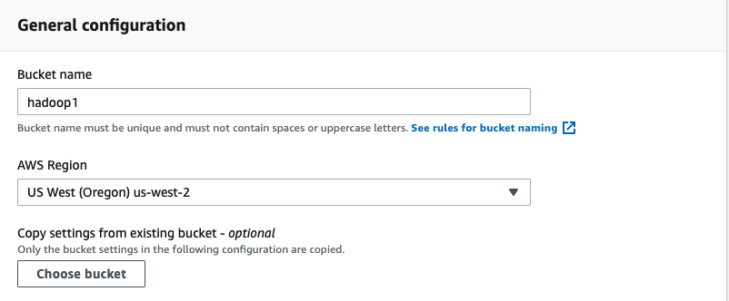

&nbsp;

### 2. Luanching of an EMR Cluster

 Launch an EMR cluster
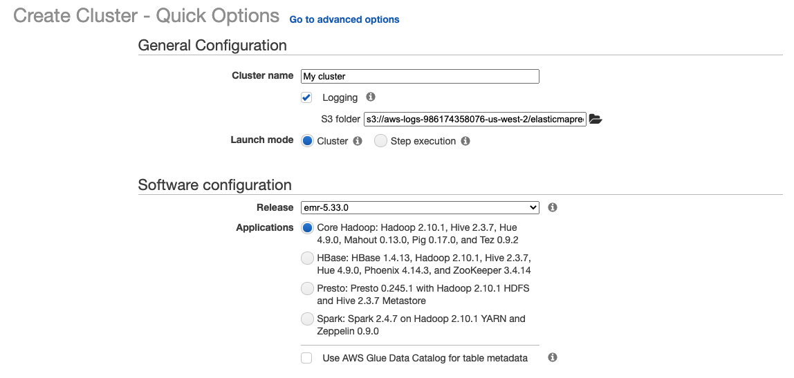

#### Set up EMR node types, instance types and instance counts
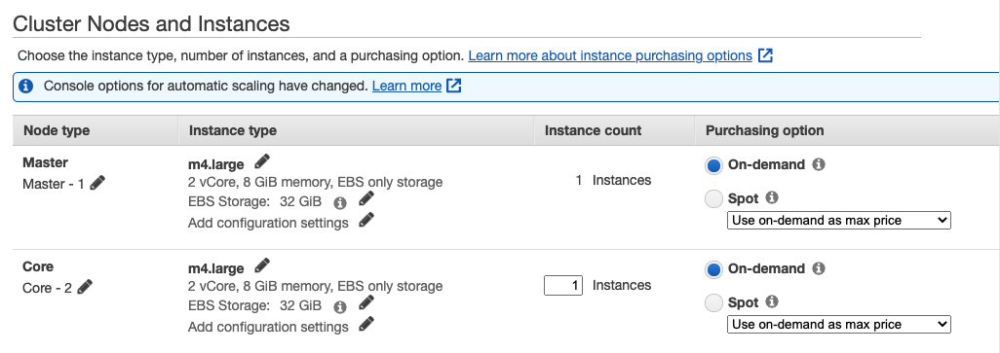
In this case, we have 2 nodes in this specific cluster: a master node and a core node
#### Set up Networking
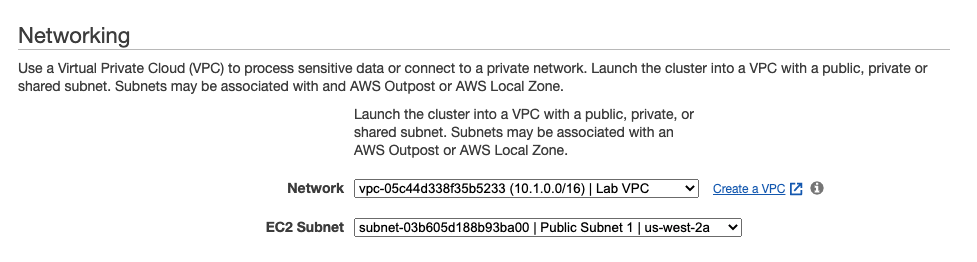

#### Cluster general settings
set up cluster name and choose the S3 bucket we've just created. "Termination protection" is to prevent the cluster from accidental termination. This needs to be turn off if we were to shut down the cluster in the end.
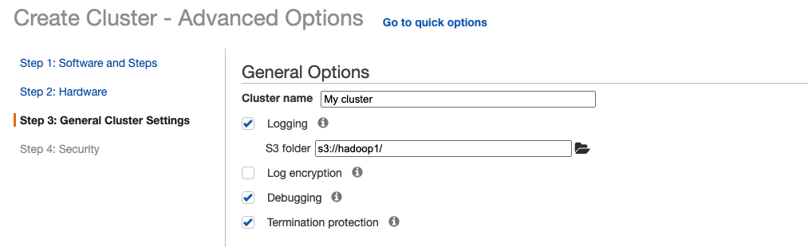
#### Set up security options
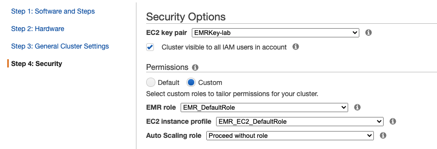
#### Set up EC2 security groups
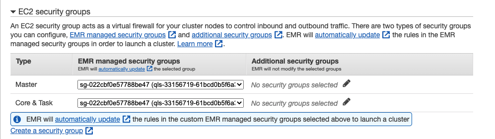
<!-- - Record EMS cluster public DNS to access EMR cluster later on.
ec2-34-220-55-173.us-west-2.compute.amazonaws.com -->

#### Finally! Luanch the cluster
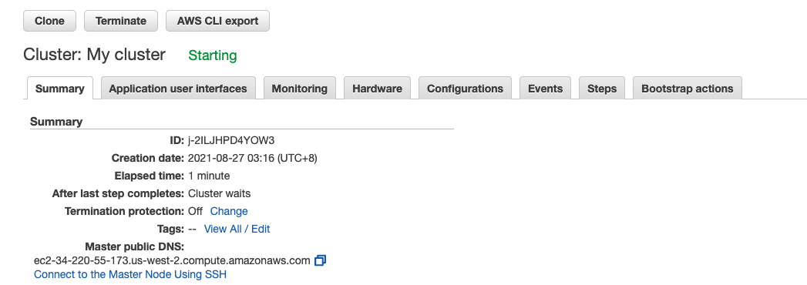
Wait patiently while status "starting" shifts to "waiting".
&nbsp;

### 3. Processing Data with Hive Script

A step in Amazon EMR is a unit of work that includeds one or more Hadoop jobs. 
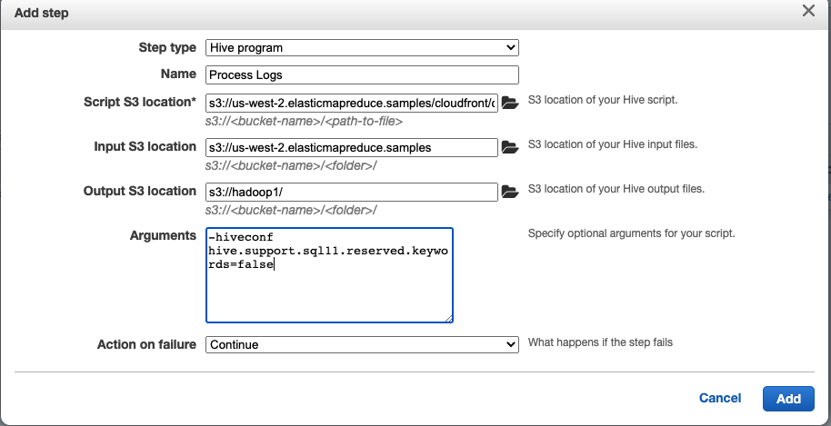

&nbsp;

### 4. View the results 

Results of the Hive Script are stored in S3 bucket. Download and view the text files of .

&nbsp;

### 5. Performing HiveQL for Data Querying
Other than performing Hive script through steps defined in EMR, we can also ssh connect to EMR cluster and conduct HiveQL through terminal.

Use EMR.pem to ssh connect to the public DNS of the cluster.
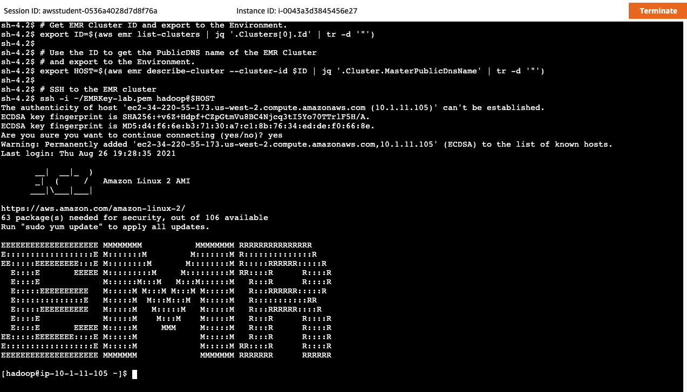

Hive application is already installed for us in the cluster. Start Hive application and input HiveQL to query log data.
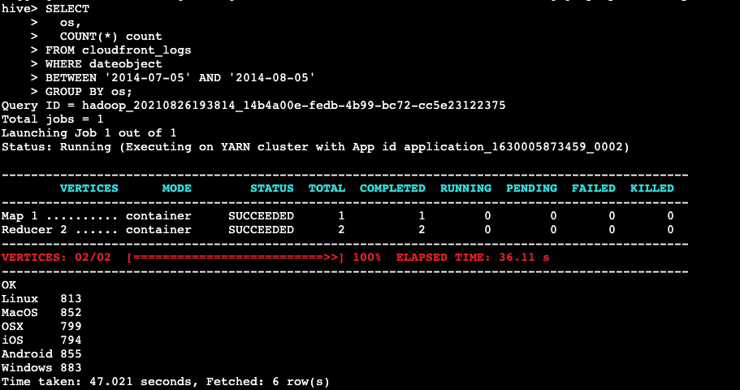

&nbsp;

