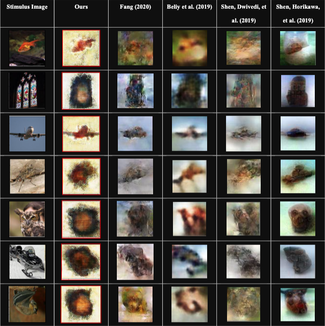

<!-- {}
Click the *Cite* button above to demo the feature to enable visitors to import publication metadata into their reference management software.
{} -->

<!-- {}
Create your slides in Markdown - click the *Slides* button to check out the example.
{} -->
# Abstract

Reconstructing stimuli images from brain activity has been a rising topic in the field of computational neuroscience due to the advent of deep learning algorithms and the advancement in functional Magnetic Resonance Imaging (fMRI) techniques. The application of deep neural networks on larger fMRI-image-paired dataset has demonstrated significant improvement in brain decoding tasks recently. Moreover, perceptive contents being hierarchically encoded in human brain has been the key to many research breakthroughs in the field. This concept provides a new window into the internal mechanisms of brain system for scientists.In this work, we follow the current state-of-the-art method “divide-and-conquer” proposed by Fang (2020). We are able to reproduce reconstruction results within 10% of the state-of-the-art performance.   

Based on the reproduced work, we further enhance our performance by introducing K-means image clustering method that captures more accurate semantic features for reconstructed images. Our experiments demonstrate the feasibility and flexibility of “divide-and-conquer” method in image reconstruction task. Most importantly, incorporating fMRI signals from different regions of visual cortex with different decoders improves the image reconstruction performance. Such implementation results map to the concept of hierarchical structure of visual cortex, giving us a medium to ex-plore more about how human brain handles visual stimuli.

## Results

 Refer to my github repository for [code](https://github.com/andwct/Image-Reconstruction-from-Hierarchical-Representations-of-Human-Visual-Cortex). 
